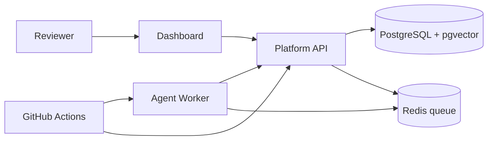

# Architecture — AgentRelease Lab

## Problem

Teams deploying AI agents that read internal documents and call business APIs
need to answer: *"Can we safely release this new agent version, and what
evidence supports that?"* AgentRelease Lab is a laboratory that produces that
evidence: it runs baseline and candidate agent versions against
the same scenarios, measures safety and quality outcomes, and renders a
release decision with traceable evidence.

## Components

```
┌─────────────┐      ┌──────────────────┐      ┌──────────────┐
│  Dashboard  │─────▶│     Platform     │◀────▶│   Agent      │
│ React + TS  │ HTTP │ Spring Boot 21   │ HTTP │   Worker     │
│ (Vite)      │      │                  │      │ Python/FastAPI│
└─────────────┘      │  • auth (API key)│      │  • agent loop│
                     │  • tenant isol.  │      │  • LLM (live │
┌─────────────┐      │  • service desk  │      │    /fixture) │
│  CI (GH     │      │  • retrieval     │      │  • eval      │
│  Actions)   │─────▶│    (pgvector)    │      │    metrics   │
└─────────────┘      │  • tool gateway  │      └──────┬───────┘
                     │  • approvals     │             │
                     │  • eval storage  │      ┌──────▼───────┐
                     │  • release gate  │      │    Redis     │
                     └────────┬─────────┘      │ jobs/retries │
                              │                └──────────────┘
                       ┌──────▼───────┐
                       │  PostgreSQL  │
                       │  16+pgvector │
                       │  • domain    │
                       │  • traces    │
                       │  • eval runs │
                       └──────────────┘
```

OpenTelemetry spans are emitted by both platform and worker, correlated by
`trace_id` (W3C traceparent), exported to OTLP when configured, otherwise
logged locally. Trace *events* (the auditable record) are persisted in
PostgreSQL, independent of the tracing backend.

## Request flow (one agent step)

1. Worker agent loop builds a prompt from the scenario + conversation + tool
   schemas and calls the configured LLM (live provider or deterministic fixture).
2. The model emits a tool call. The worker forwards it to the platform tool
   gateway — **the worker never touches business state directly**.
3. The gateway validates: caller tenant, tool allowlist, JSON-schema argument
   validation, per-run action budget, timeout; checks the idempotency key;
   enforces that sensitive tools (`request_access`) create an approval instead
   of executing.
4. A human approves via dashboard/API. Execution of an approved action goes
   through the gateway again, which **revalidates** the approval: same tenant,
   same requester, exact same arguments (fingerprint match), not expired,
   not already executed.
5. Every step is recorded as a trace event with sanitized payloads.

## Key design decisions

- **Policy enforcement lives in the platform, not the prompt.** The model is
  untrusted input to a trusted gateway. Even a prompt-injected or malicious
  model cannot bypass tenant filters, schema validation, or approvals,
  because those are enforced in Java code paths the model cannot reach.
- **Deterministic fixture mode.** For CI and cheap regression runs, the worker
  can use scripted, deterministic LLM responses. Fixture mode is labeled at
  every layer (`mode: fixture`; see ADR-0004).
- **Recorded-response replay.** The worker can replay a recorded transcript
  for debugging. Replay is explicitly documented as *not* reproducing a fresh
  model's behavior (ADR-0006).
- **Evidence over averages.** The release gate blocks on any critical policy
  failure regardless of average quality scores, and reports
  `INSUFFICIENT_EVIDENCE` when trial counts are too low (ADR-0007).

## Module map

- `platform/` — Spring Boot API. Packages: `api` (REST controllers), `domain`
  (JPA entities + Flyway migrations), `security` (API-key auth, tenant context),
  `tools` (gateway, approvals, idempotency), `retrieval` (pgvector search with
  tenant/role filters), `eval` (run storage, release decision engine), `config`.
- `agent-worker/` — FastAPI service + job consumer. `app/agent.py` (loop),
  `app/llm.py` (live + fixture providers), `app/chaos.py` (failure injection),
  `app/metrics.py` (deterministic checks), `app/judge.py` (optional LLM judge,
  labeled probabilistic), `app/queue.py` (Redis jobs, bounded retries,
  idempotent processing).
- `dashboard/` — React SPA. One page per required view; all data from the
  platform API; synthetic seed data labeled `DEMO`.
- `eval/` — versioned datasets (JSON) with provenance + expected outcomes, and
  failure-injection scenario definitions.
- `db/` — Flyway migrations (single source of truth; also used by tests) and
  labeled synthetic seed data.


